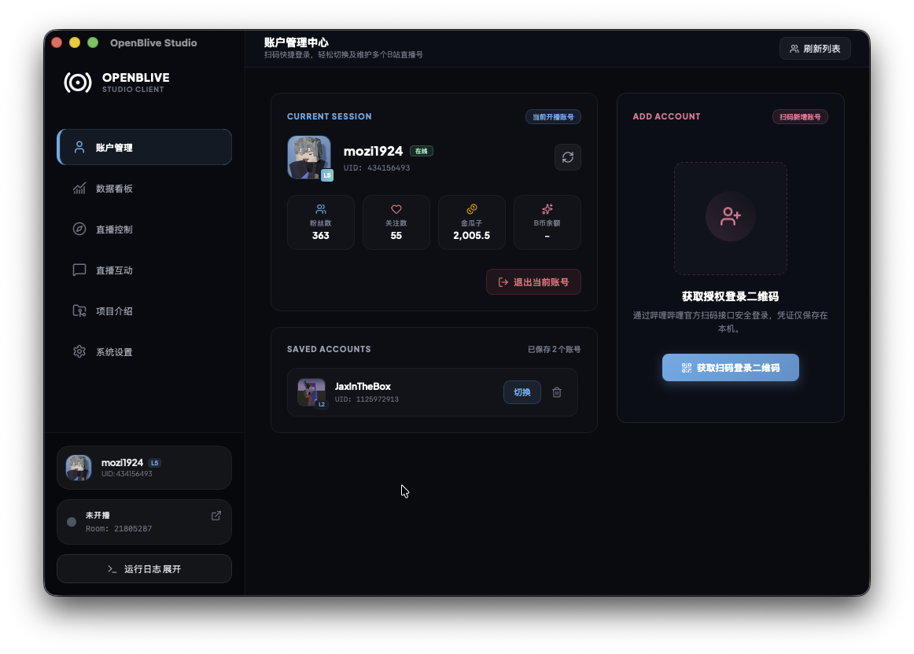
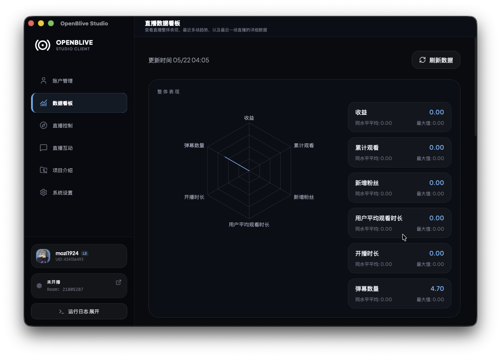
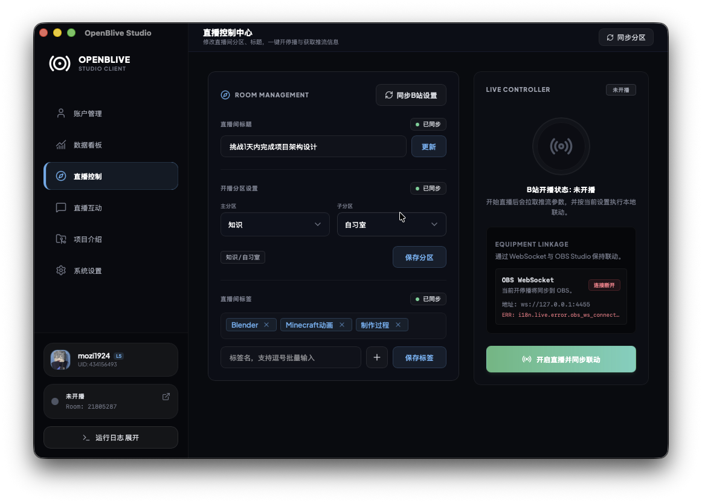
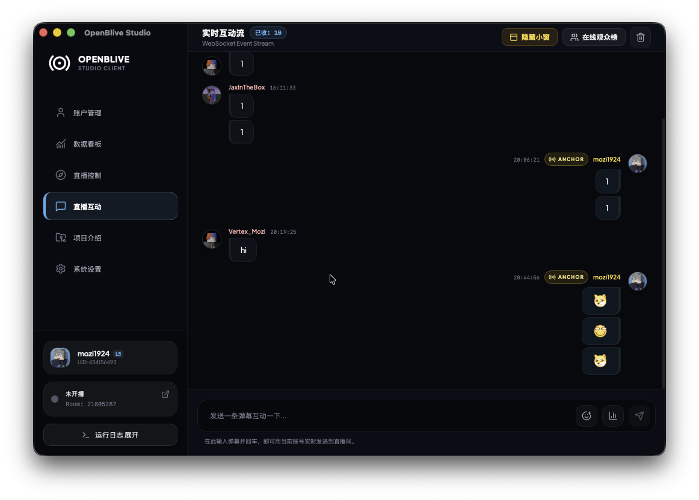
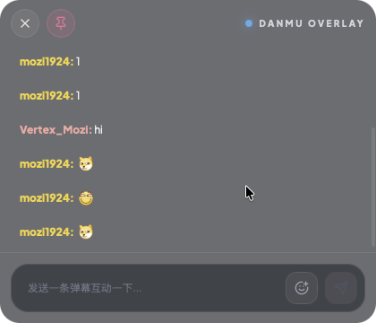

<p align="center">
  
</p>

<h1 align="center">OpenBLive Studio</h1>

<p align="center">
  <strong>一个基于 Tauri v2 + React 19 构建的轻量级第三方哔哩哔哩桌面开播助手</strong>
</p>

<p align="center">
  <a href="https://github.com/mozi1924/openblive/stargazers">
    
  </a>
  <a href="https://github.com/mozi1924/openblive/network/members">
    
  </a>
  <a href="https://github.com/mozi1924/openblive/issues">
    
  </a>
  <a href="https://github.com/mozi1924/openblive/blob/master/LICENSE">
    
  </a>
  <a href="https://tauri.app/">
    
  </a>
</p>

---

## 📖 项目介绍

**OpenBLive Studio** 是一款面向哔哩哔哩主播的第三方桌面端开播与互动工具，采用 **Tauri v2** 作为桌面容器，前端基于 **React 19**、**Vite**、**TypeScript** 与 **Tailwind CSS v4** 构建。

当前版本已经覆盖账号管理、直播数据看板、开播控制、直播互动、悬浮弹幕小窗、外部 WS/Overlay 接入、OBS/命令联动与应用更新等完整流程，目标是提供比传统直播姬更轻、更快、更清爽的桌面体验。

## ✨ 当前支持的功能

- 🔑 **账号管理**：支持扫码登录、保存多个 Bilibili 账号并快速切换当前开播账号。
- 📊 **直播数据看板**：提供整体表现雷达图、历史场次趋势，以及最近一场直播的详细数据摘要。
- 🎛️ **直播控制**：支持同步直播间资料、编辑标题 / 分区 / 标签、复用最近分区、获取并复制推流地址与推流码、一键开播 / 关播。
- 💬 **直播互动**：实时接收弹幕、礼物、大航海、Super Chat、进场、撤回等消息，支持快捷发弹幕、房间表情与直播投票。
- 🛡️ **房间管理**：支持直播间用户管理能力，包括禁言管理、黑名单管理、房管管理与分页浏览，便于在互动高峰快速完成秩序维护。
- 🪟 **弹幕小窗**：内置独立悬浮弹幕窗，支持开机自动显示、透明度调节、显示 / 隐藏与置顶控制。
- 🔌 **外部接入能力**：内置 HTTP + WebSocket 服务，开放 `/overlay`、`/api/chat`、`/ws`，兼容 blivechat 风格 Overlay。
- 🎚️ **联动控制**：支持 OBS WebSocket 联动，也支持通过 Shell Command 在开播 / 下播时触发外部动作。
- 🔄 **项目与更新**：内置版本检查与平台差异化更新入口，同时提供项目介绍、技术栈与鸣谢信息。
- 🌐 **多语言与调试配置**：支持 `auto` / `zh-CN` / `en-US`，并提供默认折叠的高级调试配置用于代理、镜像和签名参数排障。

## 🖼️ 界面预览

<table align="center" width="92%">
  <tr>
    <td align="center" width="33.33%">
      
      <br />
      <sub><strong>首页 / 账号管理</strong></sub>
    </td>
    <td align="center" width="33.33%">
      
      <br />
      <sub><strong>数据看板</strong></sub>
    </td>
    <td align="center" width="33.33%">
      
      <br />
      <sub><strong>直播控制</strong></sub>
    </td>
  </tr>
</table>

<table align="center" width="78%">
  <tr>
    <td align="center" width="50%">
      
      <br />
      <sub><strong>直播互动</strong></sub>
    </td>
    <td align="center" width="50%">
      
      <br />
      <sub><strong>弹幕小窗</strong></sub>
    </td>
  </tr>
</table>

## 🛠️ 技术栈

- **桌面容器**：[Tauri v2](https://tauri.app/) + Rust
- **前端框架**：[React 19](https://react.dev/)
- **构建工具**：[Vite 7](https://vite.dev/)
- **样式方案**：[Tailwind CSS v4](https://tailwindcss.com/)
- **图表组件**：[Recharts](https://recharts.org/)
- **兼容 Overlay 前端**：`overlay-compat`（Vue 2）

## 📚 文档导航

- [外部 WebSocket API 文档](docs/ws-api.md)
- [Overlay / blivechat 兼容层说明](docs/ws-overlay-compat.md)

<details>
  <summary><strong>🧩 高级调试配置（默认折叠）</strong></summary>

仅在以下场景建议填写，留空时程序会使用内置默认值：

- 需要通过代理、网关或镜像域名转发 Bilibili API
- 需要临时切换 App 签名参数、弹幕网关或 LiveHime 版本参数进行排障

可覆盖项包括：

- `host_www`
- `host_api`
- `host_live_api`
- `host_passport`
- `host_live_web`
- `cookie_domain`
- `danmu_host`
- `app_key`
- `app_sec`
- `http_user_agent`
- `livehime_version_override`
- `livehime_build_override`
- `live_platform`

同时支持通过环境变量注入，且优先级低于设置页中的保存值：

- `OPENBLIVE_HOST_WWW`
- `OPENBLIVE_HOST_API`
- `OPENBLIVE_HOST_LIVE_API`
- `OPENBLIVE_HOST_PASSPORT`
- `OPENBLIVE_HOST_LIVE_WEB`
- `OPENBLIVE_COOKIE_DOMAIN`
- `OPENBLIVE_DANMU_HOST`
- `OPENBLIVE_DANMU_WSS_PORT`
- `OPENBLIVE_APP_KEY`
- `OPENBLIVE_APP_SEC`
- `OPENBLIVE_HTTP_USER_AGENT`
- `OPENBLIVE_LIVEHIME_VERSION`
- `OPENBLIVE_LIVEHIME_BUILD`
- `OPENBLIVE_LIVE_PLATFORM`

补充说明：

- Host 支持填写 `host` 或完整 URL，程序会自动归一化为 origin。
- `cookie_domain` 支持填写 host 或 URL，程序会自动提取域名并规范化。
- `host_live_web` 会同时影响侧边栏“打开直播间”外链。
- `http_user_agent` 支持一键生成当前操作系统对应的系统 UA，也可手动覆盖。
</details>

## 🚀 贡献与开发指南

如果您希望在本地运行、修改或打包本项目，可以参考以下步骤。

### 前提条件

1. **Node.js**（建议 v18+）
2. **pnpm**（建议 v8+）
3. **Rust 开发环境**（需安装 `rustup`、`cargo` 以及对应操作系统构建工具，详见 [Tauri 官方安装指南](https://v2.tauri.app/start/prerequisites/)）

### 本地开发步骤

1. **克隆仓库**
   ```bash
   git clone https://github.com/mozi1924/openblive.git
   cd openblive
   ```

2. **安装依赖**
   ```bash
   pnpm install
   ```

3. **启动开发环境**
   ```bash
   pnpm tauri dev
   ```

### 构建与打包

项目包含三部分：

- 主前端：根目录 `React + Vite`
- Overlay 前端：`overlay-compat`
- 桌面后端：`src-tauri`（Rust + Tauri）

推荐按以下顺序进行本地验证：

```bash
pnpm build:desktop      # 构建主前端与 overlay 前端
pnpm build:backend      # 编译 Rust 后端（release）
pnpm package:desktop    # 打包桌面安装包
```

也可以直接执行：

```bash
pnpm verify:release
```

打包产物默认位于 `src-tauri/target/release/bundle/`。

### GitHub Release 自动构建

仓库内提供了 `.github/workflows/release.yml`，用于在发布时自动构建并上传安装包到 GitHub Release。

- 触发方式 1：推送版本标签（如 `v0.1.1`）
- 触发方式 2：手动触发 `workflow_dispatch`
- 构建平台：`macOS` / `Windows` / `Linux`

### macOS 使用提示

macOS 用户在下载并移动应用后，需要先移除隔离属性，再启动：

```bash
sudo xattr -dr com.apple.quarantine "/Applications/OpenBlive Studio.app"
```

如果应用不在 `Applications` 目录，请将命令中的路径替换为实际安装位置。

## ⚖️ 关于开源生态与官方平台兼容性的说明

本项目（OpenBLive）作为社区独立开发的轻量化工具，**旨在作为官方客户端（直播姬）的生态补充，而非替代品**。我们在此诚挚呼吁官方平台能够包容并支持本项目的存在，原因如下：

* **🌐 完善跨平台生态（Linux / macOS）**  
官方直播姬目前主要聚焦于 Windows 平台，这使得大量使用 Linux 或 macOS 的创作者、工程师、独立游戏开发者在平台开播时面临巨大的技术门槛。OpenBLive 实现了原生跨平台支持，填补了这一生态空白，能为平台吸引并留住更多高素质的跨平台创作者。
* **⚡ 优化低功耗与边缘设备体验**  
官方直播姬功能全面，但对于使用轻薄笔记本、迷你主机（Mini PC）或移动推流设备的创作者来说，其性能开销和内存占用往往会成为核心痛点。OpenBLive 经过极致的编译优化（最终体积仅约 6MB），将 CPU 和内存占用降到了最低。这保证了即使在配置有限的设备上，创作者也能流畅完成推流，极大地降低了直播的硬件门槛。
* **🌍 推进国际化与无障碍传播（i18n Support）**  
随着多元化创作者的加入，非简体中文用户（海外留学生、海外创作者等）对直播工具的需求日益增加。由于官方工具暂未全面支持国际化（i18n），OpenBLive 的多语言支持能够帮助这部分用户无缝接入平台生态，促进社区的多元化和友好交流。

**总结：**  
封杀优秀的社区开源工具，不仅会伤害核心开发者与硬核创作者的感情，也会将原本属于平台的跨平台用户、低配置用户和海外用户拒之门外。我们希望与平台共同维护一个健康、开放、多元且充满活力的技术与创作社区。

## 📈 Star History

[](https://star-history.com/#mozi1924/openblive&Date)

## 🤝 特别鸣谢

- 感谢 [bilibili-api-collect](https://github.com/socialsisteryi/bilibili-api-collect) 项目，其整理归纳的哔哩哔哩 API 接口文档为本项目的账号登录、开播控制等核心功能提供了重要参考。
- 感谢 [ChaceQC/bilibili_live_stream_code](https://github.com/ChaceQC/bilibili_live_stream_code) 项目，为本项目提供了 API 链路与实现思路参考。
- 感谢 [TNXG/bilibili_live_stream](https://github.com/TNXG/bilibili_live_stream) 项目，为本项目提供了功能设计启发。
- 感谢 [Radekyspec/StartLive](https://github.com/Radekyspec/StartLive) 项目，为本项目提供了工程实践启发。
- 感谢 [xfgryujk/blivechat](https://github.com/xfgryujk/blivechat) 项目，为本项目的外部弹幕 WS 服务与兼容 Overlay 前端提供了参考。

## 📄 开源协议

本项目采用 [MIT License](LICENSE) 开源协议。
