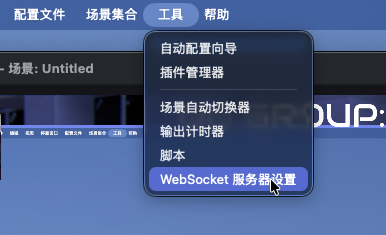
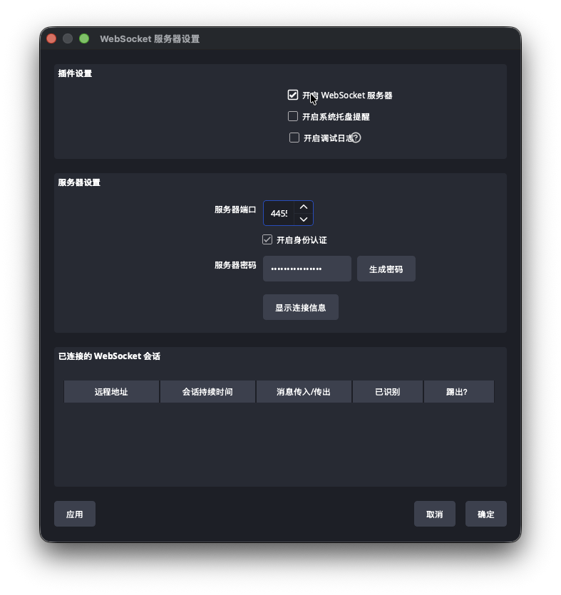
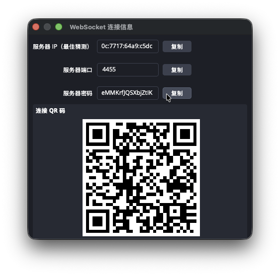
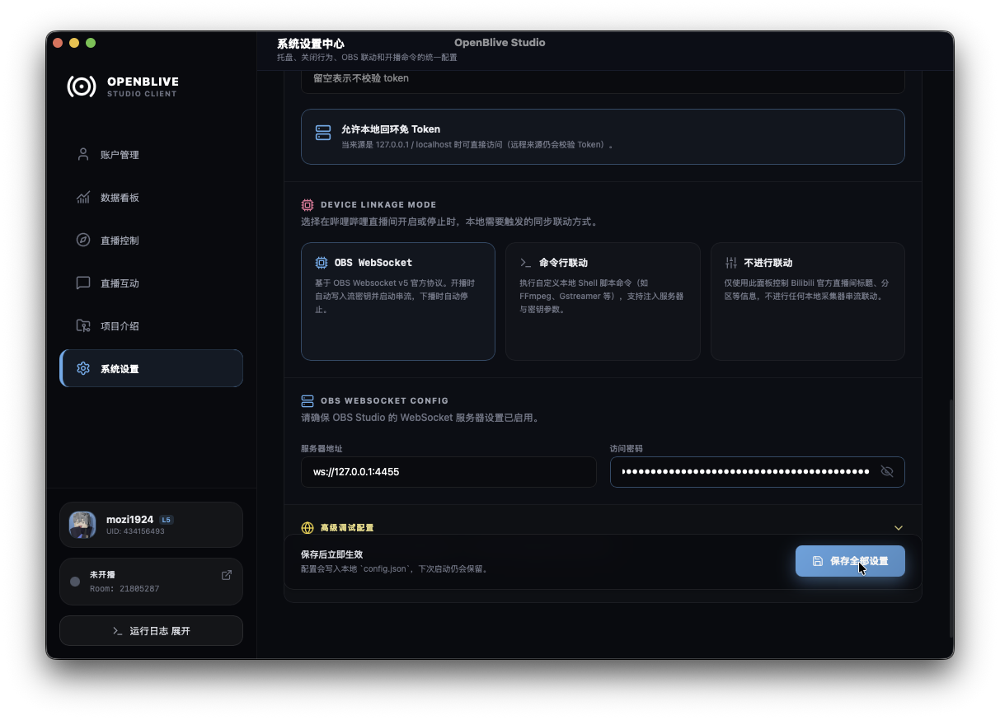

# OBS 联动配置教程

本文介绍如何让 OpenBLive Studio 通过 `OBS WebSocket` 与 OBS Studio 联动，实现开播时自动写入推流信息并启动串流、下播时自动停止。

## 适用场景

- 使用 `OBS Studio` 作为本地推流软件
- 希望在 `OpenBLive Studio` 里直接触发 OBS 开播联动
- OpenBLive 和 OBS 运行在同一台电脑，或可以通过局域网互通

## 第一步：在 OBS 中启用 WebSocket 服务器

在 OBS 顶部菜单中依次点击：

`工具` -> `WebSocket 服务器设置`



打开设置窗口后：

1. 勾选 `开启 WebSocket 服务器`
2. 保持默认端口 `4455` 即可
3. 勾选 `开启身份认证`
4. 记住或复制 `服务器密码`
5. 点击左下角 `应用`
6. 点击右下角 `确定`



如果你想直接复制连接信息，也可以点击 `显示连接信息`，然后复制其中的密码。



## 第二步：在 OpenBLive Studio 中开启 OBS 联动

打开 `OpenBLive Studio`，进入：

`系统设置` -> 下滑到 `DEVICE LINKAGE MODE`

然后选择 `OBS WebSocket`。

在下方的 `OBS WEBSOCKET CONFIG` 区域填写连接信息：

- `服务器地址`：如果 OpenBLive 和 OBS 都运行在本机，保持默认 `ws://127.0.0.1:4455` 即可
- `访问密码`：填写刚才在 OBS 中复制的 WebSocket 密码

最后点击 `保存全部设置`。



## 本机场景的最简配置

如果 `OpenBLive Studio` 和 `OBS Studio` 都运行在同一台电脑，通常只需要确认两件事：

1. OBS 已启用 `WebSocket 服务器`
2. OpenBLive 中填写正确的 `访问密码`

此时 `服务器地址` 一般不需要修改，直接使用默认的 `ws://127.0.0.1:4455` 即可。

## 常见问题

### 1. 保存后仍然无法联动

请优先检查以下几项：

- OBS 是否真的勾选了 `开启 WebSocket 服务器`
- OpenBLive 中填写的密码是否与 OBS 完全一致
- 端口是否仍为默认的 `4455`
- 是否有其他软件占用了同一个端口

### 2. OBS 和 OpenBLive 不在同一台电脑

如果两者不在同一台设备上，需要把 `服务器地址` 改成 OBS 所在机器的实际地址，例如：

```text
ws://192.168.1.10:4455
```

同时还需要确认：

- 两台设备网络互通
- 防火墙没有拦截对应端口
- OBS 端填写的密码与 OpenBLive 保持一致

### 3. 我没有开启身份认证，可以不填密码吗？

可以。如果你在 OBS 中关闭了 `开启身份认证`，那么 OpenBLive 中的 `访问密码` 可以留空。

