# 前端代码结构与膨胀度分析报告

本报告对当前 Tauri 应用的前端 React 代码进行了审查，主要评估前端的**膨胀程度（Bloat）**，并分析哪些逻辑**更有必要或更适合迁移到 Rust 后端**来实现。

---

## 1. 前端“臃肿度”评估

整体而言，目前的前端架构设计得非常清晰，逻辑与 UI 视图做到了很好的解耦。但在局部文件和组件层面上，确实存在不同程度的**体积膨胀**。

### 📊 核心文件大小一览

| 文件路径 | 大小 / 行数 | 职责定位 | 膨胀原因与现状 |
| :--- | :--- | :--- | :--- |
| [`useStudioController.ts`](file:///Volumes/Data/openblive/src/hooks/useStudioController.ts) | ~44 KB (1485行) | 主控制器 Hook | 作为“大管家”，它协调了多个子 Hook（如账号、弹幕、配置、更新等），并将上百个状态和方法平铺导出给页面。虽然做了模块化拆分，但协调逻辑本身显得过于庞大。 |
| [`StreamTab.tsx`](file:///Volumes/Data/openblive/src/features/stream/StreamTab.tsx) | ~51 KB (1078行) | 直播设置 Tab 视图 | 包含了封面上传、标题修改、预约、分区选择、标签设置、RTMP 推流码展示、OBS/命令行联动状态等 8 个以上功能区块。所有的 JSX 标记、表单提交逻辑、样式类名都挤在一个文件里。 |
| [`SettingsTab.tsx`](file:///Volumes/Data/openblive/src/features/settings/SettingsTab.tsx) | ~34 KB (753行) | 系统设置 Tab 视图 | 包含了语言选择、窗口行为设置、弹幕悬浮窗设置、联动配置以及多达 15+ 项高级 Host/API 配置。所有配置项的表单布局均合并在单一组件中。 |

### 🔍 结论：前端是否“过于庞大”？
**是的，局部组件和主控制器有明显的臃肿现象。**
- **UI 组件层：** `StreamTab` 和 `SettingsTab` 包含了过多的 inline JSX 标记、SVG 图标和 Tailwind 样式类。这使得单文件行数超过 1000 行，后期维护、修改某个局部表单极易引起误伤。
- **状态逻辑层：** 虽然已经将大部分业务拆分到了多个子控制器（如 `useAccountController`、`useDanmuVoteController` 等），但 `useStudioController` 作为一个总线，把所有的状态、引用（Refs）和处理函数全部展平返回。这种多级数据透传在没有使用全局 Context 或状态管理库（如 Zustand/Redux）的情况下，导致了代码长度增加。

---

## 2. 建议的前端重构方案（组件拆分）

为了降低前端单文件的复杂度，强烈建议对大型 UI 文件进行组件化抽离：

```mermaid
graph TD
    StreamTab[StreamTab.tsx] --> CoverPanel[components/CoverPanel.tsx]
    StreamTab --> TitlePanel[components/TitlePanel.tsx]
    StreamTab --> RoomNewsPanel[components/RoomNewsPanel.tsx]
    StreamTab --> LiveReservePanel[components/LiveReservePanel.tsx]
    StreamTab --> PartitionPanel[components/PartitionPanel.tsx]
    StreamTab --> TagsPanel[components/TagsPanel.tsx]
    StreamTab --> StreamEndpoints[components/StreamEndpointsPanel.tsx]
    StreamTab --> LinkageStatus[components/LinkageStatusPanel.tsx]

    SettingsTab[SettingsTab.tsx] --> LanguageSection[components/LanguageSection.tsx]
    SettingsTab --> WindowBehavior[components/WindowBehaviorSection.tsx]
    SettingsTab --> DanmuOverlay[components/DanmuOverlaySection.tsx]
    SettingsTab --> LinkageSection[components/LinkageSection.tsx]
    SettingsTab --> AdvancedSettings[components/AdvancedSettingsSection.tsx]
```

### 1) 拆分 [`StreamTab.tsx`](file:///Volumes/Data/openblive/src/features/stream/StreamTab.tsx)
建议在 `src/features/stream` 下创建 `components/` 目录，将以下模块抽离为独立的 React 组件：
- **`CoverPanel`**：管理封面上传、预览、裁剪、历史弹窗以及封面分值分析。
- **`TitlePanel` & `RoomNewsPanel`**：标题及房间公告的表单。
- **`LiveReservePanel`**：直播预约相关的日期选择及动态勾选。
- **`PartitionPanel` & `TagsPanel`**：管理二级联动分区选择与标签添加。
- **`StreamEndpointsPanel`**：显示 RTMP 地址、推送码并提供复制按钮。
- **`LinkageStatusPanel`**：显示 OBS Websocket 或命令行联动的状态和按钮。

### 2) 拆分 [`SettingsTab.tsx`](file:///Volumes/Data/openblive/src/features/settings/SettingsTab.tsx)
在 `src/features/settings` 下创建 `components/` 目录：
- 将语言选择、窗口行为、悬浮窗配置、高级调试配置分别抽离为小而专注的 Section 组件。

---

## 3. 是否有必要分到后端（Rust）去实现的部分？

Tauri 应用的开发模式通常是：**“前端负责视图渲染和轻量级交互，后端 Rust 负责密集计算、系统级 API 调用、后台线程管理与持久化维护”**。

根据这个原则，以下部分在 React 中实现**不够优雅，更建议移至 Rust 后端**：

### 1) 🔁 轮询与状态自动同步逻辑（强建议迁移）
* **现状：**
  在前端 [`useStudioControllerEffects.ts`](file:///Volumes/Data/openblive/src/hooks/useStudioControllerEffects.ts) 中，有多个通过前端 `window.setInterval` 维护的定时器：
  * 每 10 秒轮询一次 `syncLiveStatus`（同步直播状态）与 `getLinkageStatus`（联动状态）。
  * 每 5 秒轮询一次 `getLiveOnlineRank`（在线高能榜）。
* **痛点：**
  1. JavaScript 的定时器在窗口最小化、被锁屏或处于后台时，会被浏览器引擎（WebKit/Chromium）自动降频或暂停，导致状态同步不及时或断开。
  2. 多路定时器在 JS 单线程中轮询，会增加 WebView 渲染进程的 CPU 负担。
* **改造建议：**
  把这部分**主动定时器**移到 Rust 后端（利用 `tokio::time::interval` 或后台线程任务）：
  * Rust 后端负责维护一个后台监控 Loop，当检测到应用有活跃账号登录时，自动在后台拉取 Bilibili API（如直播间状态、在线人数、联动状态）。
  * 当状态有变更时，后端通过 Tauri 的 `emit`（事件广播）主动将最新的 `Session`、`LinkageStatus` 等数据推送给前端。
  * 前端通过 React 中的事件监听器（`listenStudioState` 等）被动接收更新，实现**响应式渲染**，彻底停用 JS 中的 `setInterval`。

### 2) 📡 第三方服务联动保活与重连（已大部分在 Rust，应继续保持）
* **分析：**
  OBS WebSocket 的保活和重连任务目前已经通过 [`ensure_obs_ws_keepalive_task`](file:///Volumes/Data/openblive/src-tauri/src/lib.rs#L139) 在 Rust 后端启动了。
* **原则：**
  涉及网络 Socket、WebSocket 保活、底层命令执行（如启动推流脚本）等逻辑，**坚决不要放在前端 JS 中**。如果未来要加入更多的流媒体软件联动，相关的网络握手与状态心跳应完全在 Rust 后端管理，前端只通过 `studioApi` 发送“控制指令”（如 `连接` / `断开`）并监听后端推送的状态。

### 3) 🎨 封面图剪裁与压缩（建议保留在前端）
* **分析：**
  目前前端 [`coverUpload.ts`](file:///Volumes/Data/openblive/src/utils/coverUpload.ts) 使用了浏览器 HTML5 Canvas 对用户上传的图片进行 16:9 居中裁剪、分辨率压缩和 JPEG 质量自适应降级（确保文件大小低于 2MB）。
* **评估：**
  虽然 Rust 使用 `image` crate 也可以做图片处理，但前端 Canvas 渲染性能极高，且完全在客户端运行，避免了用户上传未经压缩的几十兆大图到 Rust 后端导致内存激增和 IPC 传输瓶颈。**这部分逻辑保留在前端是合理的。**

---

## 4. 总结与行动指南

1. **前端需要瘦身**：逻辑解耦不错，但 UI 组件过于庞大。建议近期对 [`StreamTab.tsx`](file:///Volumes/Data/openblive/src/features/stream/StreamTab.tsx) 和 [`SettingsTab.tsx`](file:///Volumes/Data/openblive/src/features/settings/SettingsTab.tsx) 进行组件化重构，拆成数个小而美、职责单一的 Sub-Components。
2. **消灭前端 Polling**：前端目前的定时请求（如 `sync_live_status` 和 `get_live_online_rank` 等轮询）应该彻底剥离到 Rust 后端由 Tokio 异步任务统一调配，并通过 Event-driven（事件驱动）方式单向推送到 React 界面。
